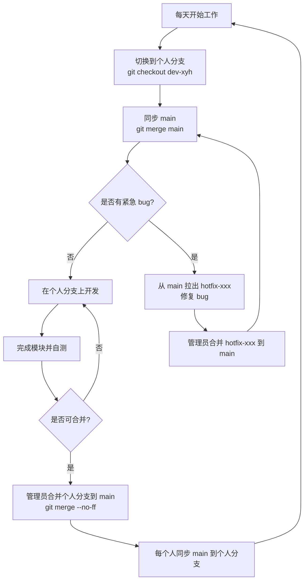

# Git 协作流程

## 流程概述

采用**长期个人分支 + 管理员统一合并**的简单 Git 协作流程。

---

## 分支策略

### 个人开发分支

- 每个人在项目开始时创建并一直使用自己的固定分支（如 `dev-xyh`）
- 所有开发工作都在各自分支上进行
- **禁止直接向 `main` 分支提交**

### 每日同步

每天开始工作前：

```bash
# 切换到自己的分支
git checkout dev-xyh

# 将主分支的最新更新同步进来
git merge main
```

### 合并上线

- 完成一个模块并自测通过后，由管理员将对应的个人分支合并到 `main`
- 合并时使用 `--no-ff` 保留合并记录
- 合并后个人分支**无需删除**，第二天继续复用

```bash
# 管理员操作：合并个人分支到 main
git checkout main
git merge --no-ff dev-xyh
```

### 紧急修复（hotfix）

如果线上出现紧急 bug，则从 `main` 临时拉出 `hotfix-xxx` 分支进行修复：

```bash
# 从 main 拉出 hotfix 分支
git checkout main
git checkout -b hotfix-xxx

# 修复完成后，由管理员合并回 main
git checkout main
git merge --no-ff hotfix-xxx
```

修复后，每个人再将 `main` 同步到自己的个人分支。

---

## 提交信息格式规范

> 每个人在自己的分支上提交时遵守。

每条提交信息采用以下格式，便于管理员合并时快速了解改动内容，也方便后续回溯问题：

```
<类型>: <简短描述>
```

### 类型说明

| 类型 | 说明 |
|------|------|
| `feat` | 新功能 |
| `fix` | 修改 bug |
| `docs` | 文档相关（如 README、注释） |
| `refactor` | 代码重构（不改变功能） |
| `chore` | 构建配置、工具等杂项 |
| `test` | 添加或修改测试代码 |

### 示例

```
feat: 完成用户登录接口
fix: 修复订单金额计算溢出问题
docs: 更新 API 文档中的参数说明
refactor: 提取重复的数据库连接代码
```

### 补充规则

1. **描述使用中文**，一句话说清楚改了什么，不超过 50 个字符
2. 如果一次提交包含多个类型，以**最主要**的那个为准，或者**拆分为多次提交**
3. 未完成的功能允许使用 `WIP:` 前缀，合并到 `main` 之前需要改回正常格式或合并为干净的提交

---

## 流程图


